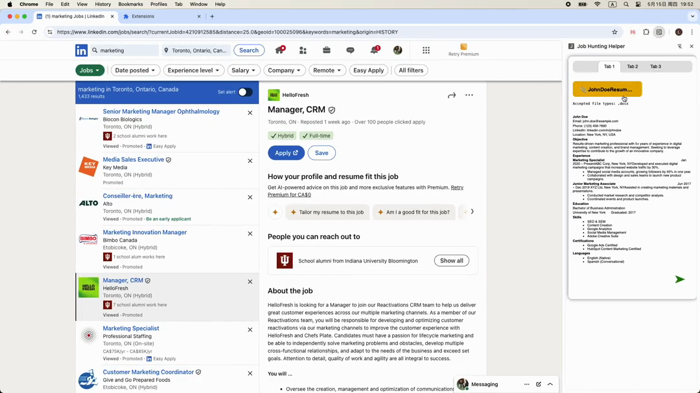
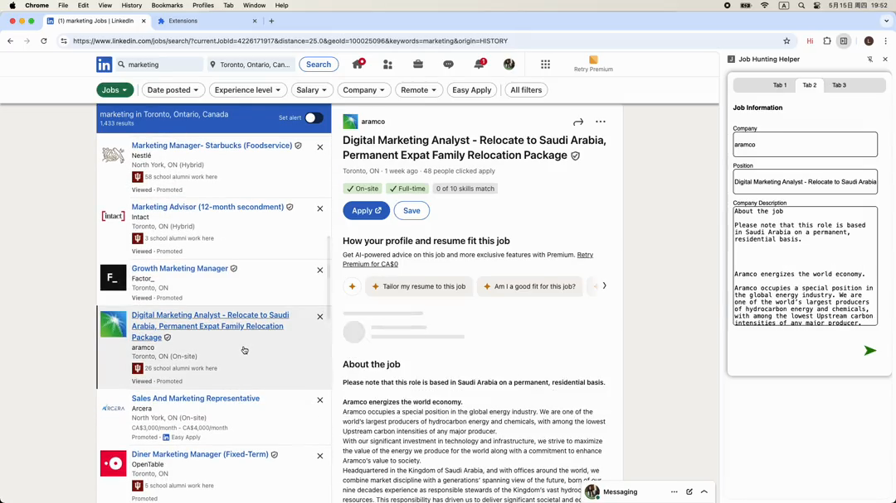
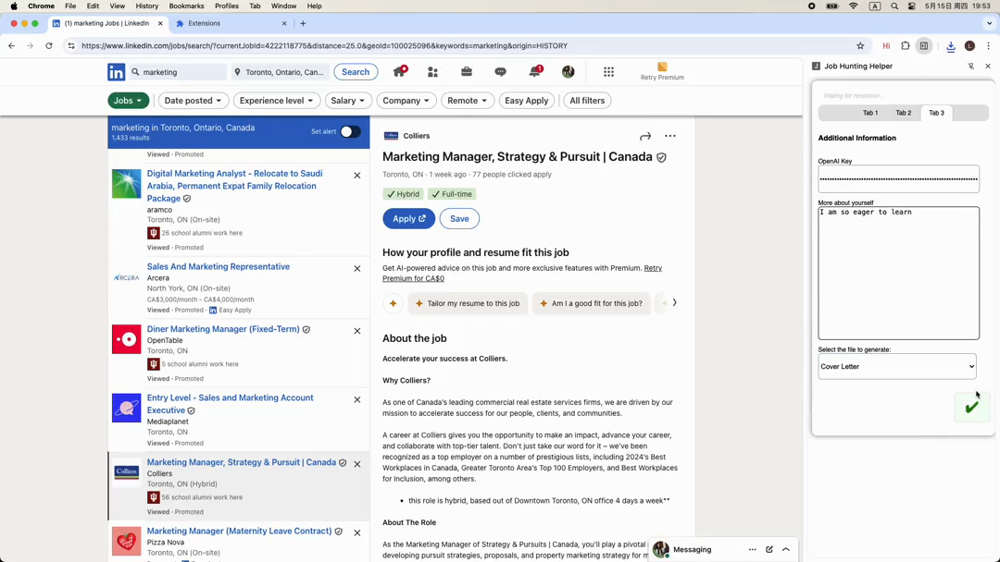

# AI Job Assistant - Chrome Extension

## Overview
AI Job Assistant is a Chrome extension powered by OpenAI that helps you optimize your resume, craft compelling cover letters, and highlight your key achievements to enhance your job search success. Whether preparing application materials or seeking career advice, this tool offers intelligent assistance right within your browser.

## Features
- **Resume Optimization**: Upload your resume and receive AI-driven suggestions to improve professionalism and clarity.
- **Cover Letter Generation**: Quickly generate personalized cover letters tailored to the job and company.
- **Highlight Achievements**: Extract and emphasize your most impactful accomplishments to stand out.
- **User-Friendly Interface**: Easily access all features via a convenient sidebar or popup.

## How to Use
1. Install the extension and click its icon to open the sidebar.
2. Upload your resume, job position, and company details.
3. Select the type of document you want to generate (Resume, Cover Letter, Achievements, etc.).
4. Click the **✔️** button to let the AI optimize and create your documents.
5. Download your enhanced files, ready for submission.

## Demo

## Feedback & Support
We welcome your feedback and bug reports via the extension’s support page or GitHub issues to help us improve.

## License
This project is licensed under the [GPL-3.0 License](https://opensource.org/licenses/GPL-3.0).
