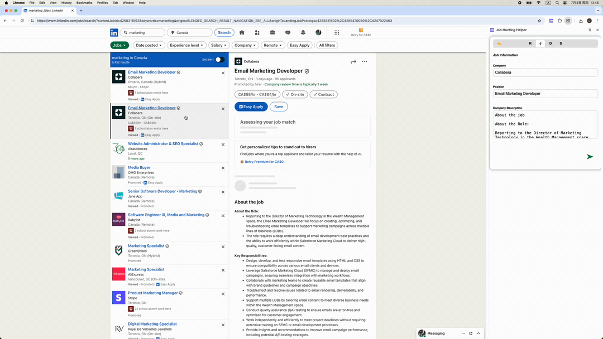
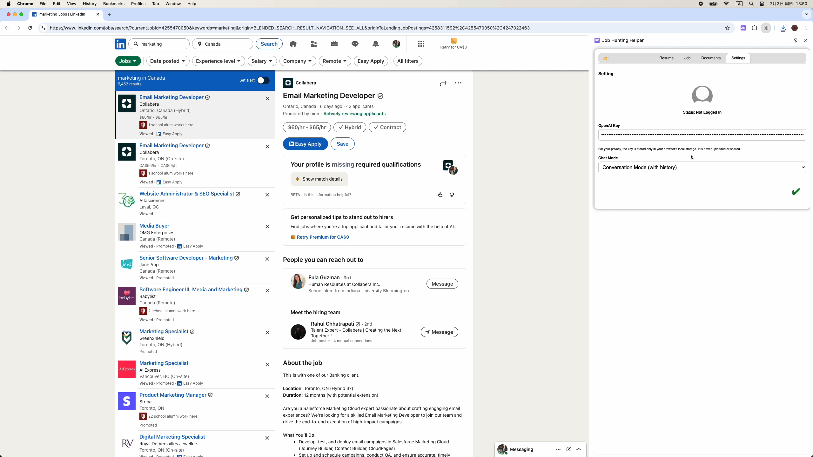
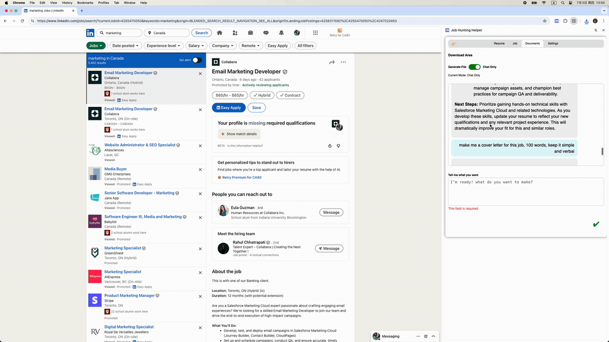

# Job Hunting Helper – Chrome Extension

## Overview
**Job Hunting Helper** is a powerful Chrome extension that integrates OpenAI’s API to streamline your job application workflow. Whether you're applying via LinkedIn, Indeed, or Monster, it helps you auto-generate resumes, cover letters, follow-ups, and more — all tailored to your resume and the job description.

Now powered by **ChatOnly**, an AI assistant that helps you navigate your job search — answer questions, analyze job fit, and guide your application process in real-time.

## Key Features
- ✅ **Resume Optimization**  
  Upload your `.docx` resume and get AI-powered suggestions to improve tone, clarity, and structure.

- ✅ **Cover Letter Generation**  
  Instantly create personalized cover letters based on any job description and your resume.

- ✅ **Achievement Highlighting**  
  Extract and emphasize your top accomplishments to make your application stand out.

- 🆕 **Generate More Job Materials**  
  Easily create other job-hunting documents:
  - Thank You Notes
  - Follow-up Emails
  - "Why Us" Answers
  - "Why This Role" Statements

- 🧠 **ChatOnly (AI Assistant)**  
  A real-time chat assistant that uses your resume and the job description to:
  - Analyze your fit
  - Answer common recruiter questions
  - Offer improvement suggestions

- ⚙️ **Settings Panel** *(New)*  
  Customize extension behavior and manage saved API keys for future updates.

- 🔍 **Automatic Job Description Scraping**  
  No more copy-paste! Scrapes job descriptions from LinkedIn, Indeed, and Monster.

- 📂 **.docx Upload & Export**  
  - Parse uploaded resumes via `Mammoth.js`  
  - Export generated content using `docx.js`

- 🔐 **Persistent OpenAI API Key Storage**  
  Securely stores your API key locally using Chrome’s Storage API.

- 🖼️ **Clean Sidebar Interface**  
  Built using Chrome’s Side Panel API for an intuitive, seamless UX.

### How It Works
1. **Install** the extension and pin it to your browser toolbar.  
2. **Open** any job listing on LinkedIn, Indeed, or Monster.  
3. **Click** the extension icon to activate the sidebar.  
4. **Upload** your resume (.docx format).  
5. **Choose** your desired output: Resume Optimization, Cover Letter, Achievements, Thank You Letter, etc.  
6. **Let the AI generate** tailored, high-quality content based on your resume and the job description.  
7. **Download** your documents as `.docx` files, ready to submit.  
8. **Need help?** Use **ChatOnly** to ask any job-hunting questions in real time — from improving your resume to preparing for interviews.  

## Demo
Here are video demos:
sb!!!!!!!!

## Tech Stack
- **Frontend**: HTML5, CSS3, JavaScript
- **Chrome Extension**: Manifest V3, Side Panel API, Chrome Storage API
- **AI Integration**: OpenAI API
- **File Handling**: Mammoth.js (parse `.docx`), docx.js (generate `.docx`)

## Project Link
GitHub: [https://github.com/lirdai/jobHuntingHelper](https://github.com/lirdai/jobHuntingHelper)

## Feedback & Support
We'd love your input! Please report bugs, request features, or share feedback via the [GitHub Issues](https://github.com/lirdai/jobHuntingHelper/issues) page.

## License
This project is licensed under the [GPL-3.0 License](https://www.gnu.org/licenses/gpl-3.0.html).

